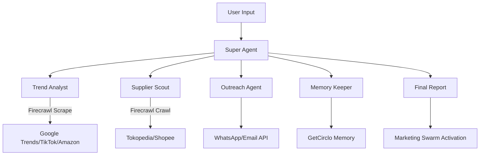

# AGENTS - TrendScout Supplier Connector

## Overview
Super AI-Agent yang menghubungkan analisis tren global dengan supplier Indonesia secara otomatis menggunakan GetCirclo Platform dan Firecrawl API.

## Agent Architecture

### 🔍 Super Agent (Orchestrator)
- **Purpose**: Koordinasi seluruh workflow dari input user hingga hasil akhir
- **Capabilities**: 
  - Interpretasi query user
  - Spawn & manage sub-agents
  - Compile hasil dari semua agents
  - Memory management
- **Integration**: GetCirclo Agent Builder, Memory API

### 📊 Trend Analyst Agent
- **Purpose**: Cari & analisis tren produk global real-time
- **Capabilities**:
  - Scrape trending data dari multiple sources
  - Analisis sentiment & growth metrics
  - Generate trend report
- **Integration**: Firecrawl API, Google Trends API
- **Tasks**:
  ```python
  # Task 1: Scrape trending products
  firecrawl.crawl("https://trends.google.com", limit=10)
  firecrawl.scrape("https://www.tiktok.com/creative_center", formats=["json"])
  firecrawl.search("trending products 2024", limit=5)
  
  # Task 2: Extract structured data
  firecrawl.scrape(url, formats=[{
    "type": "json",
    "schema": TrendingProduct.schema()
  }])
  ```

### 🔎 Supplier Scout Agent 
- **Purpose**: Temukan supplier terpercaya di Indonesia
- **Capabilities**:
  - Search marketplace Indonesia
  - Filter berdasarkan rating & lokasi
  - Validasi ketersediaan produk
- **Integration**: Firecrawl API untuk scrape Tokopedia/Shopee
- **Tasks**:
  ```python
  # Task 3: Cari supplier di marketplace
  firecrawl.scrape(
    "https://www.tokopedia.com/search?q={product}",
    formats=["markdown", "json"],
    actions=[
      {"type": "wait", "milliseconds": 2000},
      {"type": "scroll", "y": 1000},
      {"type": "screenshot", "fullPage": False}
    ]
  )
  
  # Task 4: Extract supplier info
  firecrawl.scrape(supplier_url, formats=[{
    "type": "json",
    "prompt": "Extract: nama toko, rating, lokasi, harga, stok, MOQ"
  }])
  ```

### 📧 Outreach Agent
- **Purpose**: Otomatis hubungi supplier via WhatsApp/Email
- **Capabilities**:
  - Generate pesan profesional
  - Send bulk messages
  - Track response status
- **Integration**: GetCirclo WhatsApp API, SMTP
- **Tasks**:
  ```python
  # Task 5: Generate & send messages
  message = generate_supplier_message(product, quantity)
  send_whatsapp(supplier_phone, message)
  send_email(supplier_email, subject, body)
  ```

### 💾 Memory Keeper Agent
- **Purpose**: Simpan preferensi & history user
- **Capabilities**:
  - Store user preferences
  - Track interaction history
  - Learn dari feedback
- **Integration**: GetCirclo Memory Module
- **Tasks**:
  ```python
  # Task 6: Manage user context
  save_preference(user_id, {"niche": niche, "budget": budget})
  get_history(user_id, limit=10)
  update_supplier_rating(supplier_id, rating)
  ```

## Part B - Marketing Swarm Agents

### 📱 Campaign Planner Agent
- **Purpose**: Rancang strategi marketing
- **Tasks**:
  ```python
  # Task 7: Analisis target audience
  firecrawl.scrape(
    "https://www.instagram.com/explore/tags/{product_tag}",
    formats=[{"type": "json", "prompt": "Extract demografis & engagement"}]
  )
  ```

### 🎨 Content Creator Agent
- **Purpose**: Generate konten visual & caption
- **Tasks**:
  ```python
  # Task 8: Scrape inspirasi konten
  firecrawl.crawl(
    "https://www.pinterest.com/search/pins/?q={product}",
    limit=20,
    formats=["markdown", "screenshot"]
  )
  # Generate content dengan Canva API
  ```

### 📈 Ad Manager Agent
- **Purpose**: Upload & manage campaigns
- **Tasks**:
  ```python
  # Task 9: Setup Instagram campaign
  upload_to_instagram(content, caption, hashtags)
  setup_boosting(post_id, budget, audience)
  ```

### 💬 Engager Bot Agent
- **Purpose**: Auto-reply komentar & DM
- **Tasks**:
  ```python
  # Task 10: Monitor & respond
  comments = get_instagram_comments(post_id)
  auto_reply(comment_id, response_template)
  ```

## Workflow Pipeline



## Task Execution Order

1. **Parse user query** → identify product category & requirements
2. **Scrape trend data** → Firecrawl multiple sources parallel
3. **Analyze trends** → filter top 3 trending products
4. **Search suppliers** → Firecrawl marketplace dengan actions
5. **Extract supplier data** → structured JSON extraction
6. **Generate outreach messages** → personalized per supplier
7. **Send messages** → WhatsApp/Email bulk send
8. **Compile report** → aggregate all data
9. **Save to memory** → store preferences & results
10. **Trigger marketing** → optional campaign activation

## Configuration

```yaml
# Super Agent Config
super_agent:
  name: trendscout_orchestrator
  type: orchestrator
  model: gpt-4
  memory: enabled
  sub_agents:
    - trend_analyst
    - supplier_scout
    - outreach_agent
    - memory_keeper

# Firecrawl Config
firecrawl:
  api_key: ${FIRECRAWL_API_KEY}
  default_formats: ["markdown", "json"]
  timeout: 120000
  actions_enabled: true

# GetCirclo Config
getcirclo:
  api_key: ${GETCIRCLO_API_KEY}
  whatsapp_enabled: true
  memory_enabled: true
```

## API Endpoints

```javascript
// Main endpoints
POST /api/agent/analyze-trend
POST /api/agent/find-suppliers
POST /api/agent/contact-suppliers
GET  /api/agent/status/{job_id}
POST /api/agent/launch-campaign

// Firecrawl integration
POST /api/firecrawl/scrape
POST /api/firecrawl/crawl
POST /api/firecrawl/search
GET  /api/firecrawl/status/{crawl_id}
```

## Error Handling & Retry Logic

```python
# Retry strategy for Firecrawl
max_retries = 3
for attempt in range(max_retries):
    try:
        result = firecrawl.scrape(url, formats=["json"])
        break
    except Exception as e:
        if attempt == max_retries - 1:
            fallback_to_alternative_source()
        time.sleep(2 ** attempt)  # Exponential backoff
```

## Performance Metrics

- **Response Time**: < 30 seconds end-to-end
- **Accuracy**: 85%+ supplier relevance
- **Success Rate**: 70%+ supplier response rate
- **Scraping Speed**: 10 pages/second dengan Firecrawl
- **Memory Efficiency**: Cache results for 24 hours

saya ada bebrapa api, seperti LAZADA API, dari RapidAPI, apify, firecawl juga
