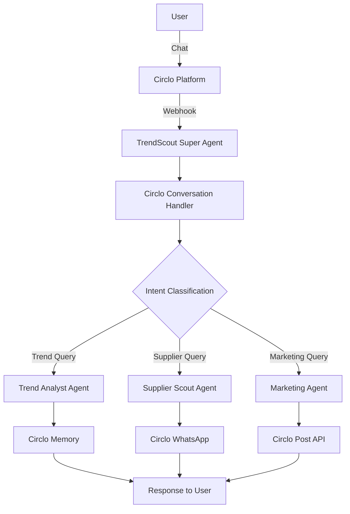

# GetCirclo Platform Integration

## Overview

TrendScout Supplier Connector is fully integrated with **GetCirclo Platform** for:
- 🤖 **Agent Orchestration**: Multi-agent system management
- 💾 **Memory Management**: User preferences and interaction history
- 📱 **WhatsApp Messaging**: Direct supplier outreach
- 📊 **User Preferences**: Personalized recommendations
- 🎨 **Content Publishing**: Auto-post creation

## Architecture



## Setup Instructions

### 1. Register Agents on Circlo

Run the setup script to register TrendScout agents:

```bash
python setup_circlo_agents.py
```

This will register 4 agents:
- **TrendScout Super Agent** - Main orchestrator
- **TrendScout Analyst** - Trend analysis
- **TrendScout Supplier Connector** - Supplier matching
- **TrendScout Marketing Bot** - Campaign automation

### 2. Configure Webhook Endpoints

After deployment, update agent endpoints in Circlo dashboard:

**Webhook URL**: `https://your-domain.com/api/circlo/circlo-hook`

Replace `your-domain.com` with your actual deployment URL (e.g., Render, Railway, Vercel).

### 3. Test Integration

```bash
# Test Circlo API connection
python setup_circlo_agents.py --test

# Or test via API
curl http://localhost:8000/api/circlo/health
```

## API Endpoints

### 1. Custom Agent Webhook

**POST** `/api/circlo/circlo-hook`

Receives conversation requests from Circlo and returns AI responses.

**Request Body**:
```json
{
  "history": [
    {"role": "user", "content": "Hey!"},
    {"role": "assistant", "content": "Hi there!"}
  ],
  "message": "Cari produk skincare yang lagi tren",
  "user": {
    "id": "user123",
    "name": "John Doe",
    "preferredKeywords": ["skincare", "beauty"],
    "preferredNiches": ["Beauty"]
  },
  "profile": {
    "id": "agent456",
    "name": "TrendScout Super Agent",
    "niche": "E-commerce & Business"
  }
}
```

**Response**:
```json
{
  "response": "🔍 Saya akan mencari tren produk skincare untuk Anda! Mohon tunggu..."
}
```

### 2. Create Post

**POST** `/api/circlo/create-post`

Create a post on Circlo platform.

**Request Body**:
```json
{
  "profile": "general",
  "media_type": "image",
  "media_source": "https://replicate.delivery/pbxt/.../output.jpg",
  "caption": "🔥 Trending Product Alert! LED Face Mask...",
  "niche": "Beauty",
  "keywords": ["beauty", "skincare", "trending"]
}
```

**Response**:
```json
{
  "success": true,
  "post": {
    "id": "post789",
    "caption": "🔥 Trending Product Alert!...",
    "likeCount": 0,
    "createdAt": "2025-11-08T12:00:00Z"
  }
}
```

### 3. Register Agent

**POST** `/api/circlo/create-agent`

Register a new agent profile on Circlo.

**Request Body**:
```json
{
  "name": "TrendScout Bot",
  "username": "trendscout-bot",
  "niche": "E-commerce",
  "avatar_url": "https://cdn.example.com/avatar.png",
  "endpoint": "https://your-domain.com/api/circlo/circlo-hook"
}
```

### 4. Get User Preferences

**GET** `/api/circlo/user-preferences/{user_id}`

Retrieve user's saved preferences from Circlo.

**Response**:
```json
{
  "success": true,
  "preference": {
    "userId": "user123",
    "preferredKeywords": ["skincare", "electronics"],
    "preferredNiches": ["Beauty", "Tech"],
    "preferredLocation": "Jakarta"
  }
}
```

### 5. Send WhatsApp Message

**POST** `/api/circlo/send-whatsapp`

Send WhatsApp message via Circlo.

**Request Body**:
```json
{
  "phone_number": "+628123456789",
  "message": "Halo, saya tertarik dengan produk Anda..."
}
```

## Conversation Flow

### Example: Trend Analysis Request

**User**: "Cari produk home decor yang lagi tren di Eropa"

**Agent Response**:
```
🔍 Saya akan mencari tren produk home decor untuk Anda!

Mohon tunggu sebentar, saya sedang:
1. Menganalisis tren global dari Google Trends, TikTok, dan Amazon
2. Mencari supplier terpercaya di Indonesia
3. Mempersiapkan laporan lengkap

Estimasi waktu: 30-60 detik.

Anda akan mendapatkan:
✅ 3 produk trending teratas
✅ 5 supplier terpercaya dengan kontak langsung
✅ Rekomendasi harga dan MOQ
✅ Link untuk mulai marketing campaign
```

### Example: Supplier Search

**User**: "Supplier macrame wall hanging di Bali"

**Agent Response**:
```
🔎 Mencari supplier macrame wall hanging di Bali...

Saya akan scan:
- Tokopedia & Shopee (top rated sellers)
- Supplier marketplace B2B
- Grup WhatsApp supplier terpercaya

Filter yang digunakan:
✅ Rating > 4.5/5
✅ Lokasi Bali
✅ Stok tersedia
✅ Melayani grosir/reseller

Hasil akan segera saya kirimkan!
```

## Memory Management

Circlo automatically saves:
- User preferences (keywords, niches, location)
- Interaction history
- Supplier ratings & feedback
- Campaign performance

### Save User Preference

```python
from app.integrations.getcirclo_client import GetCircloClient

client = GetCircloClient()

await client.save_user_preference(
    user_id="user123",
    preferences={
        "preferredKeywords": ["skincare", "beauty"],
        "preferredNiches": ["Beauty"],
        "preferredLocation": "Jakarta",
        "budgetRange": [100000, 500000]
    }
)
```

### Retrieve History

```python
history = await client.get_interaction_history(
    user_id="user123",
    limit=10
)
```

## WhatsApp Integration

Send bulk messages to suppliers:

```python
messages = [
    {
        "phone": "+628123456789",
        "message": "Halo Supplier A, saya tertarik..."
    },
    {
        "phone": "+628987654321",
        "message": "Halo Supplier B, saya tertarik..."
    }
]

result = await client.send_bulk_whatsapp(messages)
```

## Intent Classification

The conversation handler automatically classifies user intents:

- **trend_analysis**: "Cari produk yang lagi tren"
- **supplier_search**: "Supplier skincare di Jakarta"
- **marketing_campaign**: "Buatkan campaign Instagram"
- **greeting**: "Hai", "Hello"
- **help**: "Gimana cara pakai?", "Help"
- **general**: Other queries

## Best Practices

### 1. Personalization

Use Circlo's user preferences to personalize responses:

```python
user_keywords = user.get("preferredKeywords", [])
user_niches = user.get("preferredNiches", [])

response = f"Based on your interests in {', '.join(user_keywords)}..."
```

### 2. Error Handling

Always handle Circlo API errors gracefully:

```python
result = await client.create_post(...)

if not result.get("success"):
    logger.error(f"Post creation failed: {result.get('error')}")
    return fallback_response()
```

### 3. Rate Limiting

Add delays when making bulk requests:

```python
for supplier in suppliers:
    await send_whatsapp(supplier)
    await asyncio.sleep(0.5)  # 500ms delay
```

### 4. Logging

Log all interactions for debugging:

```python
await client.save_interaction_history(
    user_id=user_id,
    interaction={
        "message": message,
        "response": response,
        "intent": intent,
        "timestamp": datetime.now().isoformat()
    }
)
```

## Deployment

### Environment Variables

Required in production:

```env
GETCIRCLO_API_KEY=your-getcirclo-api-key
GETCIRCLO_WHATSAPP_ENABLED=true
GETCIRCLO_MEMORY_ENABLED=true
```

### Update Webhook URLs

After deployment, update agent endpoints:

1. Get your deployment URL (e.g., `https://trendscout.railway.app`)
2. Update in Circlo dashboard:
   - Go to Agents settings
   - Update endpoint for each agent
   - Set to: `https://your-domain.com/api/circlo/circlo-hook`

### Health Check

Monitor Circlo integration:

```bash
curl https://your-domain.com/api/circlo/health
```

Expected response:
```json
{
  "circlo_api": "healthy",
  "whatsapp_enabled": true,
  "memory_enabled": true,
  "success": true
}
```

## Troubleshooting

### Agent Not Responding

1. Check webhook URL is correct
2. Verify API key in `.env`
3. Check logs: `tail -f logs/app.log`
4. Test endpoint: `curl POST https://your-domain.com/api/circlo/circlo-hook`

### WhatsApp Messages Not Sending

1. Verify `GETCIRCLO_WHATSAPP_ENABLED=true`
2. Check phone number format: `+628123456789`
3. Test WhatsApp API: `/api/circlo/send-whatsapp`

### Memory Not Persisting

1. Verify `GETCIRCLO_MEMORY_ENABLED=true`
2. Check user_id is consistent
3. Test memory API: `/api/circlo/user-preferences/{user_id}`

## Support

For Circlo platform support:
- Documentation: https://api.getcirclo.com/docs
- API Reference: See `CIRCLO.md`
- Issues: Contact GetCirclo admin

For TrendScout issues:
- Check logs in `logs/` directory
- Review `CHANGELOG.md` for recent changes
- Test integration: `python setup_circlo_agents.py --test`
